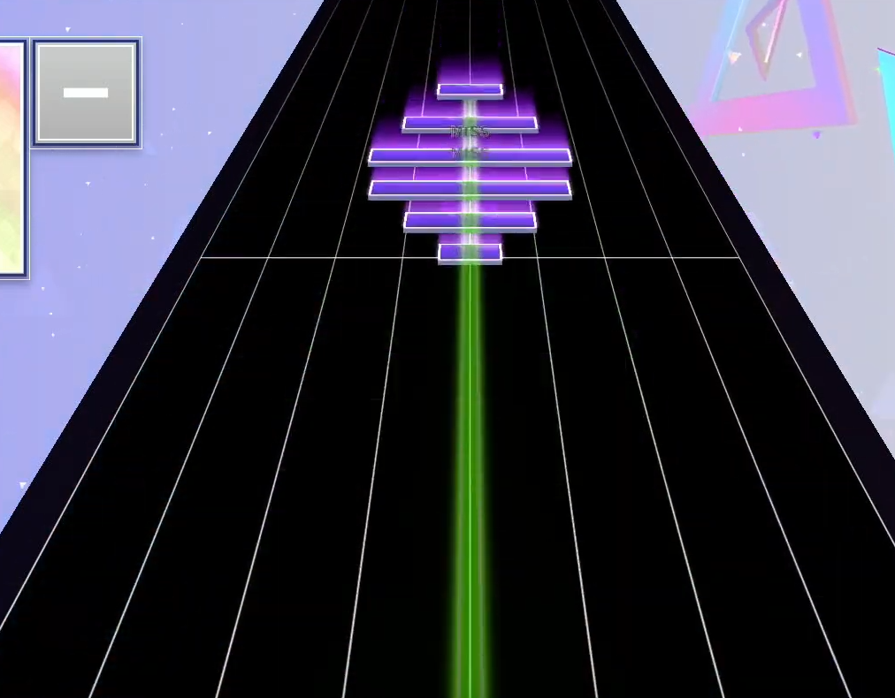

# C2S Chart Documentation (v1.13.00)

This is a revised version of the C2S unofficial specifications, which includes updates and corrections to the original document. The changes are based on the latest C2S chart version 1.13.00, used since *CHUNITHM NEW* and later.

## Note Types

### Tap Notes (`TAP`)

A basic tap note that requires a single tap to hit. It is represented by a red bar.


**Schema:**

```text
TAP [measure] [tick] [cell] [width]
```

Example: `TAP 8 0 6 4`

### ExTap Notes (`CHR`)

A special tap note that will always return a "Justice" (Perfect/Marvelous) judgement regardless of timing. It is represented by a golden bar.

There are also variants of standard notes with ExTap properties, usually represented by its normal note type internally but with `X` as the second character in the note type string. These are apparently called "Fake ExTap" notes, and they are used in some charts to create a visual effect of a tap note that is not actually an ExTap.

- `SXD` - Fake ExTap Slide
- `SXC` - Fake ExTap Slide (Control Point)
- `HXD` - Fake ExTap Hold

> "Fake ExTaps" are introduced in C2S 1.13.00.


**Schema:**

```text
CHR [measure] [tick] [cell] [width] [modifier]
```

- `modifier`: Direction modifier ("UP", "CE", "DW")

Example: `CHR 9 0 4 8 CE`

### Hold Notes (`HLD`)

A hold note that requires the player to hold down the button for a certain duration. It is represented by an orange bar with a blue-yellow gradient tail.


**Schema:**

```text
HLD [measure] [tick] [cell] [width] [duration]
```

- `duration`: Hold duration in ticks

Example: `HLD 18 0 0 3 192`

**ExHold Notes (`HXD`):**

```text
HXD [measure] [tick] [cell] [width] [duration]
```

Example: `HXD 12 96 8 4 288`

### Slide Notes (`SLD`)

A note similar to a hold note, but it requires the player to slide their finger across the slider bar. It is represented by a blue bar with a magenta-blue gradient tail.


**Schema:**

```text
SLD [measure] [tick] [cell] [width] [duration] [end_cell] [end_width]
```

- `duration`: Slide duration in ticks
- `end_cell`: Final horizontal position (can be decimal)
- `end_width`: Final width in cells (can be decimal)

Example: `SLD 8 148 0 4 236 0 4`

**ExSlide Notes (`SXD`):**

```text
SXD [measure] [tick] [cell] [width] [duration] [end_cell] [end_width]
```

Example: `SXD 12 379 9 6 5 10 6`

#### Slide Control Points (`SLC`)

Slide control points are waypoints that define the path of a slide note. They control the direction and curvature of the slide path, allowing for complex slide patterns.

- `SLC` - Standard slide control point that starts immediately with movement
- `SXC` - Slide control point that starts with an ExTap (Fake ExTap variant)

**SLC Schema:**

```text
SLC [measure] [tick] [cell] [width] [duration] [end_cell] [end_width]
```

Example: `SLC 8 96 4 4 7 3 4`

**SXC Schema:**

```text
SXC [measure] [tick] [cell] [width] [duration] [end_cell] [end_width] [target] [modifier]
```

- `target`: Reference to slide note ("SLD")
- `modifier`: Direction modifier ("UP")

Example: `SXC 12 0 10 6 9 9 6 SLD UP`

### AIR Notes (`AIR`, `A*`)

Air notes are special notes that require the player to wave to the IR sensors without touching any buttons. They are usually represented by an animated green arrow.


**Basic AIR Schema:**

```text
AIR [measure] [tick] [cell] [width] [target_note]
```

- `target_note`: Referenced note type ("CHR", "TAP", etc.)

Example: `AIR 9 0 4 8 CHR`

**Directional Air Notes Schema (AUR, AUL, ADW, ADR, ADL):**

```text
A[direction] [measure] [tick] [cell] [width] [target_note] [modifier]
```

- `direction`: UR (up-right), UL (up-left), DW (down), DR (down-right), DL (down-left)
- `target_note`: Referenced note type
- `modifier`: Usually "DEF" - a default modifier indicating no special behavior

Example: `AUL 14 288 0 4 FLK DEF`

There are also other cosmetic variants of air notes with diagonal hints, which are used in some charts to hint to the player that they should hover in a specific direction. The game technically only keeps track of vertical velocity for these notes, so they can still be hit by simply waving your hand up and triggering the IR motion sensor.

> [!NOTE]
> Sometimes you may not even need to use your hand to trigger the IR sensor, as any body part that blocks the IR sensors may trigger it.
> This is an intended gimmick in some harder charts,
>
> 

#### AIR Down Notes (`AD*`)

AIR down notes are a variant of air notes that require the player to trigger the sensor by moving their hand downwards. They are represented by a pink arrow pointing downwards. The triggering mechanic is the same as for regular AIR notes, but inverted.


#### AIR-ACTION and AIR-Hold Notes

AIR-ACTION notes are extensions of air notes, and they go hand in hand with "air-holds".


The green line stemming from the initial air note indicates that you
need to keep your hand hovering within the air sensor region (the "air-hold"),
and purple bars that fall towards the judgement line (the air-action) are again triggered by movement within the air sensor region.
This can be movement up through the sensor, down through the sensor, or even waving up and down. Timing windows are similarly generous.

When a player misses an AIR-ACTION note, the game will display a message on the bottom right corner of the screen, hinting that the player should try to hover their hand in the air sensor region.


**AHD - Air Hold Schema:**

```text
AHD [measure] [tick] [cell] [width] [target_note] [duration]
```

- `target_note`: Referenced note type ("SLD", "CHR", etc.)
- `duration`: Hold duration in ticks

Example: `AHD 9 0 0 4 SLD 192`

**AHX - AIR-Hold with Green Ground Bar** *(Undocumented)*?

```text
AHX [measure] [tick] [cell] [width] [target_note] [duration] [modifier]
```

- `target_note`: Referenced note type ("SLD", "TAP", etc.)
- `duration`: Duration in ticks (typically 96)
- `modifier`: Usually "DEF"

AHX notes are AIR-Hold notes with a green ground bar (hybrid air/ground hold note). They appear as a green bar on the ground with air sensor activation required.

They are used as independent AIR notes that do not require any other base notes to depend on. They can be used to create patterns that require the player to hover their hand in the air sensor region while also hitting other notes, like hold/slide notes that end with an AIR wave.

**AIR-ACTION Implementation:**

AIR-ACTION notes are movement-triggered purple bars in the air sensor region. They require hand movement within the air sensor region rather than just hovering. **AIR-ACTION notes are implemented using ALD+NON:**

- **ALD+NON notes** - Purple floating bars that can be used individually or in patterns

**Example alternating pattern (2/4 clap, ExTap + AIR-ACTION):**

```text
AHX 65 192 12 4 SLD 96 DEF      # AIR-Hold with green ground bar
CHR 65 240 4 8 RS               # ExTap (1/8 offbeat)
ALD 65 240 12 4 38400 5.0 1 12 4 5.0 NON  # AIR-ACTION (purple floating bar)
CHR 65 288 4 8 RS               # ExTap (1/8 offbeat)
ALD 65 288 12 4 38400 5.0 1 12 4 5.0 NON  # AIR-ACTION (purple floating bar)
```

**AIR CRUSH patterns:** Multiple ALD+NON notes placed simultaneously create geometric patterns like the "melon pattern" (6 simultaneous AIR-ACTIONs).

Example: `AHX 33 192 0 4 SLD 96 DEF`

**ALD - Air Slide Schema** *(Undocumented)*?

```text
ALD [measure] [tick] [cell] [width] [duration] [param1] [param2] [end_cell] [end_width] [param3] [param4]
```

**Parameter Meanings:**

- `param1`: Visual depth parameter (usually 1.0-9.0)
- `param2`: Timing parameter (usually 1-12)  
- `param3`: Visual depth parameter (usually 1.0-9.0)
- `param4`: **Visual effect and behavior modifier** *(inferred)*
  - `"DEF"` - Regular air slide notes (standard behavior)
  - `"NON"` - Purple AIR-ACTION notes (standard scoring AIR-ACTIONs)
  - `"GRY"` - **Gray non-scoring visual effects** (wind/motion lines, atmospheric effects)
  - `"YEL"` - **Fake ExTap AIR-ACTIONs** (yellow/golden visual styling, always returns Justice like other Fake ExTap notes)
  - `"BLK"` - **Black/invisible air effects** (hidden visual elements, non-scoring)

**Visual Effect System Discovery:**

The final parameter (`param4`) controls a sophisticated visual effects system that allows chart designers to create:

- 🌪️ **Atmospheric effects**: `GRY` notes create non-scoring wind motion lines and particle effects
- 🎨 **Color-coded gameplay**: `YEL` provides Fake ExTap variant for AIR-ACTIONs (always Justice)  
- 👻 **Hidden polish**: `BLK` creates invisible timing markers and subtle visual elements
- 🎯 **Standard gameplay**: `NON` for regular purple AIR-ACTIONs, `DEF` for air slides

**Thematic Usage Example (Kyoufuu All Back):**

The wind-themed chart uses `GRY` effects extensively to simulate wind motion:

```text
ALD 6 0 0 1 0 4.0 12 3 2 4.0 GRY    # Wind particle (non-scoring)
ALD 6 0 0 1 0 6.0 12 3 2 6.0 GRY    # Wind particle (different depth)
ALD 6 0 0 1 0 8.0 12 3 2 8.0 GRY    # Wind particle (different depth)
```

These create layered wind effects with varying visual depths (4.0, 6.0, 8.0) without affecting scoring.

**Examples:**

- `ALD 66 0 7 2 38400 5.0 2 7 2 1.0 NON` (Purple AIR-ACTION)
- `ALD 10 0 11 2 0 1.0 1 13 2 6.0 DEF` (Regular air slide)
- `ALD 6 0 0 1 0 4.0 12 3 2 4.0 GRY` (Gray wind effect, non-scoring)
- `ALD 59 240 12 4 2 5.0 4 10 2 1.0 YEL` (Fake ExTap AIR-ACTION variant - yellow/golden, always Justice)
- `ALD 17 221 9 2 0 1.0 2 9 1 1.0 BLK` (Black/invisible effect)

**ASC - Air Slide Control Point Wrapper Format** *(Documented)*

ASC is primarily a **wrapper format** (like ASD) that can encapsulate any note type with air-related parameters:

```text
ASC [measure] [tick] [cell] [width] [wrapped_type] [param1] [duration] [end_cell] [end_width] [param2] [param3]
```

**Fields:**

- `wrapped_type`: The note type being wrapped (SLD, ASC, CHR, etc.)
- `param1`: First air parameter (usually 5.0)
- `duration`: Duration in ticks
- `end_cell`: End cell position
- `end_width`: End width
- `param2`: Second air parameter (usually 5.0-10.0)
- `param3`: Third air parameter (usually "DEF")

**Examples:**

- `ASC 2 96 12 4 SLD 5.0 12 6 4 5.0 DEF` (wraps SLD)
- `ASC 5 336 9 4 ASC 5.0 22 9 5 5.0 DEF` (wraps ASC recursively!)
- `ASC 49 280 12 2 ASC 7.0 11 12 2 10.0 DEF` (nested ASC wrapping)

**Key Discovery:** ASC can wrap any note type, including itself, creating recursive wrapper structures similar to ASD.

#### AIR CRUSH Notes

> These are introduced in C2S 1.13.00.

AIR CRUSH notes are **AIR-ACTION notes (ALD+NON) arranged in specific patterns and played simultaneously**. They create complex 3D voxel-based visual effects in the air sensor region when multiple ALD+NON notes are triggered at the same time.


**Key Understanding:** AIR CRUSH is not a separate note type, but rather a **visual/gameplay effect** created when multiple ALD+NON notes (AIR-ACTIONs) are arranged in specific geometric patterns.

**Implementation:**

AIR CRUSH effects are created by placing multiple ALD notes with the "NON" parameter at the same timing:

```text
Multiple ALD [measure] [tick] [cell] [width] [duration] [param1] [param2] [end_cell] [end_width] [param3] NON
```

**Key characteristics:**

- Uses "NON" parameter (AIR-ACTION) instead of "DEF" (regular air slides)
- **Multiple notes placed simultaneously** to create 3D geometric shapes
- Parameter values (param1, param3) control visual depth/layering (typically 1.0-6.0)
- Cell positions and widths define the overall shape pattern
- All notes in the pattern require hand movement in the air sensor region

**Example - "Melon Pattern" (6 simultaneous AIR-ACTIONs):**

```text
ALD 42 0 5 6 6 3.0 1 5 6 3.0 NON
ALD 42 0 5 6 6 4.0 1 5 6 4.0 NON
ALD 42 0 6 4 6 2.0 1 6 4 2.0 NON
ALD 42 0 6 4 6 5.0 1 6 4 5.0 NON
ALD 42 0 7 2 6 1.0 1 7 2 1.0 NON
ALD 42 0 7 2 6 6.0 1 7 2 6.0 NON
```

This creates a symmetrical spherical pattern with:

- **6 pairs** of notes creating depth
- **Varying widths** (6, 4, 2) for curved appearance
- **Different parameter values** (1.0-6.0) for layering effects



---

Note: The types marked with `?` are not fully documented and may require further investigation.

The following air note types have been observed and documented based on actual chart data:

- `AIR` - Regular AIR (up) note
- `AUR` - AIR Up (with right diagonal hint)
- `AUL` - AIR Up (with left diagonal hint)
- `ADW` - AIR Down
- `ADL` - AIR Down (with left diagonal hint)
- `ADR` - AIR Down (with right diagonal hint)
- `AHD` - AIR Hold (standard purple bar in air)
- `AHX` - AIR-Hold with green ground bar (hybrid air/ground note)
- `ALD` - Air slides, AIR-ACTION when used with NON parameter
- `ASC` - Air Slide Control Points
- `ASD` - AIR Slide (wrapper format)

**AIR-ACTION Implementation:** AIR-ACTION notes (purple floating bars requiring movement) are implemented using `ALD` notes with the `NON` parameter. Multiple simultaneous ALD+NON notes create AIR CRUSH patterns.

> **Note**: AIR-ACTION notes are triggered by any movement within the air sensor region - this includes moving up, down, or waving back and forth. The timing windows for these notes are generally more generous than standard notes.

---

## Flick Notes (`FLK`)

Flick notes are notes that require a flick in either horizontal direction to hit. These notes only appear in MASTER and harder difficulties, and they are represented by a silver bar with a blue center.


**Schema:**

```text
FLK [measure] [tick] [cell] [width] L
```

- Always ends with "L" (presumably for "Left" default direction)

Example: `FLK 14 0 0 4 L`

## Mine Notes (`MNE`)

Mine notes are special notes that require the player to avoid hitting them. They are represented by a dark-blue bar with electric sparks.

- Hitting a mine note results in a "Miss" judgement and breaks the player's combo.
- Ignoring (not hitting) a mine note counts as a successful avoidance, granting a "Justice" judgement and contributing to the player's score and combo.

**Schema:**

```text
MNE [measure] [tick] [cell] [width]
```

Example: `MNE 15 192 8 2`

## Special Note Types

### Default/Placeholder note (`DEF`) ?

This is a special placeholder note type added in C2S 1.13.00. It is used to represent an empty note in the chart, such as an independent AIR note with no other notes bound to it. It's invisible and is used to maintain the structure of the chart without adding any visible elements.

**Schema:**

None, this note type is only used as a null pointer(?) for some AIR or other notes.

```text
AUL 14 288 0 4 FLK DEF
```

### ASD/ASC Wrapper Formats

Both ASD and ASC are special 12-field wrapper formats that can encapsulate any other note type with additional air-related parameters:

**ASD Schema:**

```text
ASD [measure] [tick] [cell] [width] [wrapped_type] [param1] [duration] [end_cell] [end_width] [param2] [param3]
```

**ASC Schema:**

```text
ASC [measure] [tick] [cell] [width] [wrapped_type] [param1] [duration] [end_cell] [end_width] [param2] [param3]
```

**Fields:**

- `wrapped_type`: The note type being wrapped (TAP, CHR, SLD, HLD, ASC, even ASD)
- `param1`: First air parameter (usually 5.0)
- `duration`: Duration in ticks
- `end_cell`: End cell position (integer)
- `end_width`: End width (integer)
- `param2`: Second air parameter (usually 5.0)
- `param3`: Third air parameter (usually "DEF")

**ASD Examples:**

- `ASD 12 0 0 6 CHR 5.0 384 0 3 5.0 DEF` (wraps CHR)
- `ASD 13 0 10 6 SLD 5.0 384 13 3 5.0 DEF` (wraps SLD)
- `ASD 18 0 0 3 HLD 5.0 192 3 3 5.0 DEF` (wraps HLD)
- `ASD 56 240 8 4 ASD 5.0 144 8 4 5.0 DEF` (wraps ASD recursively)
- `ASD 2 108 6 4 ASC 5.0 84 6 4 5.0 DEF` (ASD wrapping ASC)

**ASC Examples:**

- `ASC 2 96 12 4 SLD 5.0 12 6 4 5.0 DEF` (wraps SLD)
- `ASC 5 336 9 4 ASC 5.0 22 9 5 5.0 DEF` (wraps ASC recursively!)
- `ASC 49 280 12 2 ASC 7.0 11 12 2 10.0 DEF` (nested ASC wrapping)

**Key Features:**

- **Both formats are functionally equivalent** wrapper formats
- **Recursive wrapping**: Both ASD and ASC can wrap themselves or each other
- **Cross-format wrapping**: ASD can wrap ASC and vice versa
- **Any note type**: Both can wrap any note type including TAP, CHR, SLD, HLD, etc.

---

## Basic Note Format

All notes in C2S format follow a tab-separated value structure with the following base fields:

```text
[TYPE] [measure] [tick] [cell] [width] [additional_fields...]
```

**Base Fields (required for all notes):**

- `TYPE`: Note type identifier (TAP, CHR, SLD, etc.)
- `measure`: Measure number where the note appears (integer)
- `tick`: Offset within the measure in ticks (integer)
- `cell`: Horizontal position (0-15, representing 16 cells)
- `width`: Width of the note in cells (integer)

---

## Implementation Notes

> **NOTE:**
> All the types marked with `?` (ALD, ASC, DEF) are not fully documented and may differ from actual specifications.
> Testing with real chart data is required to confirm the exact format.

### Enum Variants in Rust Implementation

- `Tap` (TAP)
- `ExTap` (CHR)
- `Hold` (HLD)
- `ExHold` (HXD)
- `Slide` (SLD)
- `ExSlide` (SXD)
- `SlideControlPoint` (SLC)
- `ExSlideControlPoint` (SXC)
- `Flick` (FLK)
- `Air` (AIR)
- `AirHold` (AHD)
- `AirHoldGround` (AHX)? *- AIR-Hold with green ground bar, schema inferred*
- `AirSlide` (ALD)? *- Air slides, AIR-ACTION when used with NON parameter*
- `AirSlideControlPoint` (ASC)? *- Undocumented, schema inferred*
- `AirDirectional` with variants for (AUR, AUL, ADW, ADR, ADL)
- `Default` (DEF)? *- Placeholder note type*
- `Mine` (MNE)
- `Unknown(String)` for unrecognized note types

### ASD/ASC Wrapper Implementation

Both ASD and ASC wrapper formats are implemented as a special parsing mode that:

1. Extracts the wrapped note type from field 5
2. Uses the wrapped type for note behavior and type determination
3. Preserves all wrapper parameters in a `WrappedNoteInfo` structure
4. Allows detection of originally wrapped notes for conversion/export
5. Supports recursive wrapping (ASD wrapping ASC, ASC wrapping ASC, etc.)

**Key Implementation Details:**

- **Both ASD and ASC** use identical 12-field wrapper structure
- **Wrapped type resolution**: The actual note type is determined by the `wrapped_type` field
- **Cross-format compatibility**: ASD can wrap ASC and vice versa
- **Recursive support**: Both formats can wrap themselves indefinitely
- **Metadata preservation**: Original wrapper format and parameters are preserved for round-trip conversion

### Unknown Note Types

Unknown note types are parsed as `Unknown(String)` variants to ensure forward compatibility. This allows the parser to handle future note types that may be introduced in later versions of the C2S format without breaking existing functionality.

## Summary

This documentation represents our current understanding of the C2S v1.13.00 format based on reverse engineering and analysis of actual chart files. Key findings include:

### New features introduced in C2S v1.12.00 and v1.13.00

1. **ASD/ASC Wrapper Formats**: Both ASD and ASC are 12-field wrapper formats that can encapsulate any other note type with additional air parameters. They are functionally equivalent wrapper formats.

2. **ASC Dual Nature**: ASC serves as both a wrapper format (12-field) and can appear as a wrapped note type within other wrappers.

3. **Recursive Wrapping**: Both ASD and ASC can wrap themselves or each other, creating nested wrapper structures (e.g., ASC wrapping ASC).

4. **Cross-Format Wrapping**: ASD can wrap ASC and ASC can wrap ASD, demonstrating format interoperability.

5. **Parameter Patterns**: Most wrapper notes use consistent parameters (param1=5.0, param2=5.0, param3="DEF").

6. **AIR CRUSH Implementation**: AIR CRUSH notes are implemented using ALD notes with "NON" parameter, allowing complex 3D voxel-based visual effects through multiple simultaneous notes.

7. **🔥 AIR-ACTIONs** - AIR-ACTION notes are implemented as:
   - **ALD+NON notes**: Purple floating bars requiring hand movement in air sensor region
   - **AHX notes**: AIR-Hold with green ground bar (hybrid air/ground hold note), NOT AIR-ACTION
   - Multiple simultaneous ALD+NON notes create AIR CRUSH patterns (e.g., "melon pattern")

8. **🌪️ ALD Visual Effects System** - ALD notes support advanced visual effects through the final parameter:
   - **GRY**: Non-scoring atmospheric effects (wind motion lines, particle effects)
   - **YEL**: Fake ExTap AIR-ACTIONs (yellow/golden coloring, always returns Justice)
   - **BLK**: Invisible/hidden visual elements for polish and timing
   - **NON**: Standard purple AIR-ACTIONs
   - **DEF**: Regular air slide behavior
   - Enables thematic chart design with atmospheric effects matching song content

### Implementation Status

- ✅ **Fully Implemented**: TAP, CHR, FLK, HLD, HXD, SLD, SXD, SLC, SXC, AIR, AHD, AUR/AUL/ADW/ADR/ADL, MNE, DEF
- ✅ **ASD/ASC Wrapper Formats**: Complete implementation with metadata preservation and recursive wrapping support
- ✅ **AHX**: AIR-Hold with green ground bar format documented and implemented
- ✅ **AIR-ACTION**: ALD+NON implementation discovered and documented
- ✅ **AIR CRUSH**: Multiple simultaneous ALD+NON patterns documented
- 🔥 **NEW: ALD Visual Effects System**: GRY/YEL/BLK effect parameters discovered and documented
- ⚠️ **Partially Documented**: ALD (visual effect system inferred from chart analysis)

### Future Work

- Validate ALD field interpretations with more chart samples
- Research param1/param2/param3 semantic meanings in ASD format  
- Investigate AIR CRUSH pattern variations in newer chart versions
- Document edge cases for AHX (AIR-Hold with green ground bar) usage
- **Study ALD visual effects system** across different charts and themes
- **Document behavioral differences** between GRY/YEL/BLK effect parameters
- **Research thematic usage patterns** of visual effects in chart design
- Validate ASC dual format behavior in more complex charts
- Investigate if other note types support similar visual effect parameters

---

*This specification is based on analysis of CHUNITHM chart files and may be updated as new information becomes available.*

## Special System Commands

### SFL - Scroll Flow/Speed Control

SFL commands control the scroll speed and flow of notes during gameplay. This is extensively used in WORLD'S END charts to create special visual effects, or even some MASTER charts to create complex gameplay patterns, mostly seen in gimmick WORLD'S END or Crossovers from Arcaea.

**Schema:**

```text
SFL [measure] [tick] [duration] [speed_multiplier]
```

**Fields:**

- `measure`: Measure where the speed change begins
- `tick`: Tick offset within the measure  
- `duration`: Duration of the speed change in ticks
- `speed_multiplier`: Speed multiplier value (can be decimal, negative, or extreme values)

**Speed Multiplier Values:**

- `1.0` - Normal scroll speed
- `0.0` - **Stop scrolling** (notes freeze in place)
- `0.5-0.9` - Slow motion effects
- `1.2-4.0` - Faster scrolling
- `10000.0` - **Extreme fast scroll** (notes disappear instantly)
- `-95.5` - **Reverse scroll** (notes move backwards)
- `-2.0` to `-0.5` - Various reverse/rewind effects

**Thematic Usage Example (from Kyoufuu All Back WORLD'S END 戻):**

```text
# Normal oscillating wind effect
SFL 4   0   24  1.200000     # Slight speedup
SFL 4   24  48  0.900000     # Slight slowdown
SFL 4   96  24  1.200000     # Speedup again
SFL 4   120 48  0.900000     # Slowdown again

# "Rail blown away" effect - instant disappearance  
SFL 10  0   1   10000.000000 # Notes vanish instantly
SFL 10  1   23  -2.000000    # Strong reverse
SFL 10  24  24  -1.000000    # Medium reverse  
SFL 10  48  24  -0.500000    # Light reverse
SFL 10  72  24  0.500000     # Return to slow forward

# Complete stop effect
SFL 20  192 24  0.000000     # Freeze notes
SFL 20  216 48  4.000000     # Sudden burst forward

# Periodic reverse gusts
SFL 6   95  1   -95.500000   # Strong reverse gust
SFL 6   191 1   -95.500000   # Repeat pattern
SFL 6   287 1   -95.500000   # Every 96 ticks
SFL 6   383 1   -95.500000   # Regular intervals
```

**Visual Effects Created:**

- 🌪️ **Wind oscillation**: Alternating 1.2/0.9 speed creates swaying motion
- ⚡ **Instant vanish**: 10000.0 speed makes notes disappear immediately  
- ⏪ **Reverse wind**: Negative values create notes flowing backwards
- 🛑 **Frozen time**: 0.0 speed freezes all note movement
- 💨 **Wind bursts**: Quick transitions between extreme values

### Technical Details and Arcaea Crossover Usage

The SFL (Scroll Flow/Speed) command is not only used for visual scroll effects, but is also essential for recreating complex scroll speed patterns in crossover charts, especially from games like Arcaea. In these charts, SFL is used to mimic sudden speed-ups, slow-downs, stops, and even reverse scrolling, matching the original game's visual and gameplay effects.

**Schema (from v1.08.00 spec):**

| Beginning Measure | Offset | Duration | Multiplier |
| ----------------- | ------ | -------- | ---------- |

- **Multiplier precision:** The multiplier must have an accuracy of 0.000001 (six digits after the decimal point).
- **Effect:** This value multiplies the player's current playfield speed, so notes will appear faster or slower based on this value. It is purely cosmetic and does not affect note timing or placement.
- **Negative values:** Negative multipliers result in the board moving in reverse, often used for dramatic or gimmick effects (e.g., Fracture Ray MASTER).
- **Crossover usage:** SFL is heavily used in Arcaea crossover charts to faithfully reproduce the original game's scroll speed changes, stops, and reversals.

> Example: In Arcaea crossovers, SFL commands are used to create sudden stops, rapid speed-ups, and reverse scrolls, matching the original chart's visual flow and challenge.

For more details, see the original v1.08.00 documentation and real chart examples.
